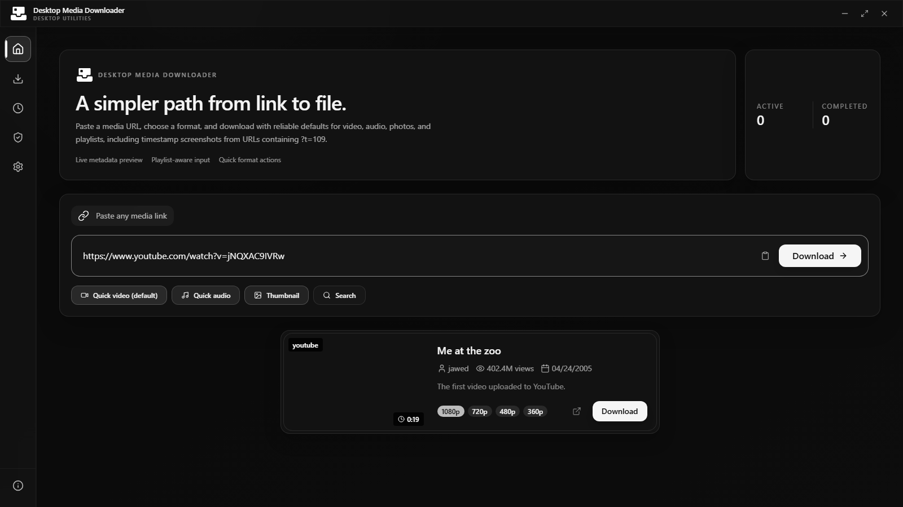
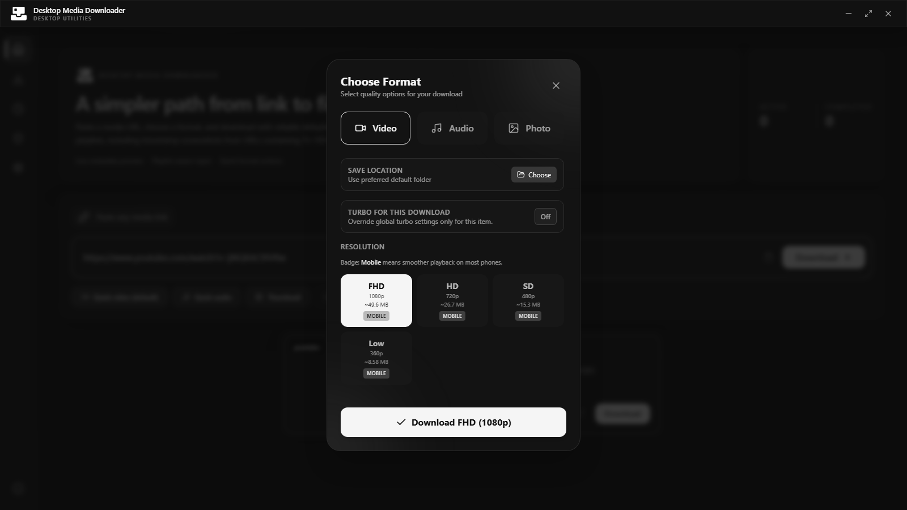
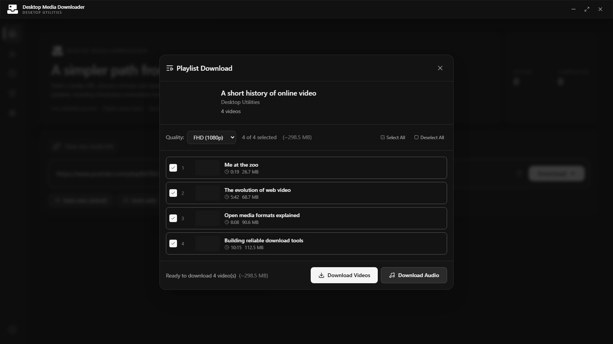
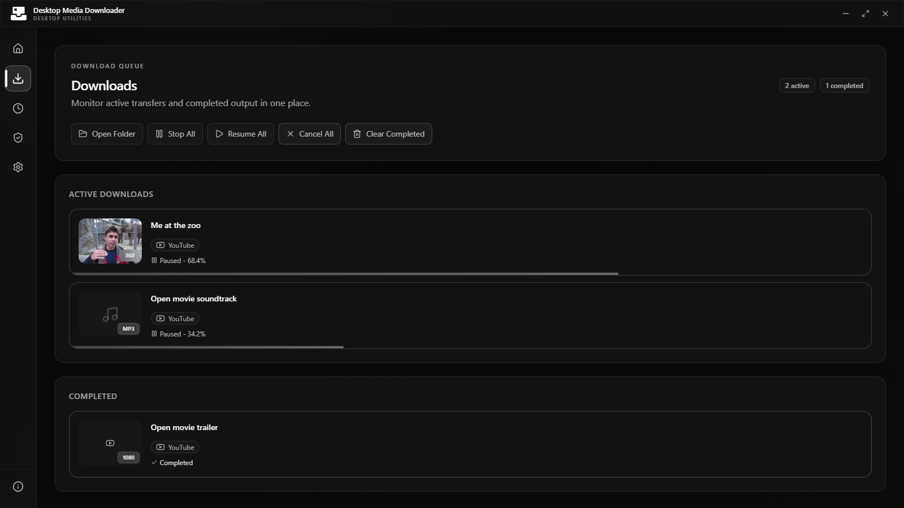

# Desktop Media Downloader

<p align="center">
  <picture>
    <source media="(prefers-color-scheme: dark)" srcset="branding/desktop-media-downloader-icon-inverted.svg" />
    
  </picture>
</p>

<p align="center">
  An open-source yt-dlp desktop GUI for Windows, macOS, and Linux.
</p>

<p align="center">
  <a href="https://desktoputilities.github.io/desktop-media-downloader/download/">Download</a>
  ·
  <a href="https://github.com/desktoputilities/desktop-media-downloader/releases">Releases</a>
  ·
  <a href="#development">Development</a>
</p>

Desktop Media Downloader is an open-source video and audio downloader for Windows, macOS, and Linux. The app provides a focused graphical interface for yt-dlp, with fast URL previews, format controls, playlists, and a persistent download queue—no terminal workflow required.

It is a [Desktop Utilities](https://github.com/desktoputilities) project built with Electron, React, and TypeScript. The interface uses a professional monochrome design with native light and dark modes.

## Features

- URL metadata preview before a download starts
- Video, audio, thumbnail, and timestamp screenshot workflows
- Quality and format selection with estimated file sizes
- Playlist selection, batch downloads, and search
- Pause, resume, retry, cancel, and persistent download history
- Optional browser-cookie support for media you can access legitimately
- Bundled, checksum-verified yt-dlp and an included JavaScript runtime
- Graceful no-FFmpeg fallback for compatible combined streams
- Windows, macOS, and Linux installers built by GitHub Actions

## Supported media sites

The app works with YouTube and other websites supported by its bundled yt-dlp media engine. Site support can change as platforms update, so the application ships a pinned, checksum-verified downloader and checks for newer compatible releases.

Only download media you own or are authorized to save. Desktop Media Downloader is not designed to bypass DRM, paywalls, or access controls.

## Screenshots

| Home and URL preview | Format selector |
| --- | --- |
|  |  |

| Playlist selection | Download queue |
| --- | --- |
|  |  |

## Install

Download the latest `.exe`, `.dmg`, or `.AppImage` from the [download page](https://desktoputilities.github.io/desktop-media-downloader/download/) or [GitHub Releases](https://github.com/desktoputilities/desktop-media-downloader/releases).

The project is open source and is not currently commercially code-signed. Windows SmartScreen or macOS Gatekeeper may therefore display a trust warning. Review the source and download only from the official organization links above.

## Development

Node.js 24 or later and npm 11 or later are recommended.

```bash
git clone https://github.com/desktoputilities/desktop-media-downloader.git
cd desktop-media-downloader
npm ci
npm run dev
```

`npm ci` downloads the matching Electron runtime and the pinned official yt-dlp standalone build, then verifies the downloader checksum. FFmpeg is optional but recommended for merging separate audio/video streams and media conversion. No separate Python or system yt-dlp installation is required.

### Verification and packaging

```bash
npm run check
npm run build:app
npm run build:bundled
```

| Command | Purpose |
| --- | --- |
| `npm run dev` | Run the desktop app in development mode |
| `npm run check` | Run tests, lint, and TypeScript checks |
| `npm run build:app` | Compile the renderer, main process, and preload bundles |
| `npm run build:bundled` | Prepare dependencies and build the platform installer |
| `npm run prepare:yt-dlp` | Download and checksum-verify the pinned downloader |

See [SYSTEM_REQUIREMENTS.md](SYSTEM_REQUIREMENTS.md) for platform-specific details.

## Release process

1. Set the release version in `package.json`.
2. Run `npm run check` and `npm run build:bundled` locally.
3. Push the matching tag, such as `v1.0.0`.
4. GitHub Actions verifies the tag, tests the project, and creates installers for all supported platforms.
5. The download page reads the latest assets from the GitHub release.

To publish the download page, enable GitHub Pages from the `main` branch and `/docs` folder in repository settings.

## Project structure

```text
.github/        Continuous integration and release automation
branding/       Canonical SVG brand sources
build/icons/    Installer icon sources
docs/           GitHub Pages download site and screenshots
electron/       Electron main process, preload, and yt-dlp integration
public/         Renderer assets
scripts/        Dependency and release verification helpers
src/            React renderer
bin/            Generated bundled runtime (not committed)
```

## Contributing

Bug reports and focused pull requests are welcome. Read [CONTRIBUTING.md](CONTRIBUTING.md) before submitting changes.

## Legal

MIT licensed. See [LICENSE](LICENSE), [LEGAL.md](LEGAL.md), and [THIRD_PARTY_NOTICES.md](THIRD_PARTY_NOTICES.md).

This software is for lawful use only. Users are responsible for copyright compliance, local law, and platform terms of service.
